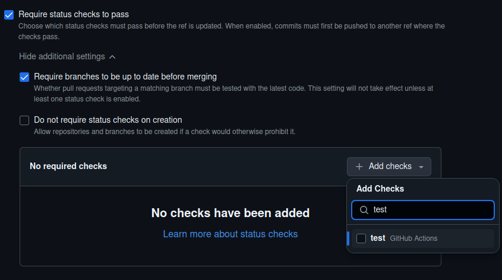

# Rulesets for opensafely-actions repositories

This directory houses two JSON files that can be used to import rulesets into
a repository in the `opensafely-actions` organization.
We recommend you apply these rulesets to repositories housing reusable actions
within the organization.

## Importing a ruleset into a repository

### Importing the JSON file
You can import a ruleset into a repository by:
 - Download the appropriate JSON file from this directory
 - Follow [the instructions in the GitHub docs for importing a ruleset](https://docs.github.com/en/repositories/configuring-branches-and-merges-in-your-repository/managing-rulesets/managing-rulesets-for-a-repository#importing-a-ruleset) 
 - Review the imported ruleset, adding further configuration (e.g. status checks) if needed (see below)

### Adding required status checks to the ruleset (if applicable)
The ruleset that protects the default branch requires status checks to pass before merging PRs.
When the ruleset is imported, you will have to add the required status checks manually in the web UI.
You can do this via the "Add checks" button under the additional settings for the "Require status checks
to pass" rule (see the screenshot below).

Please ensure that you add the required status checks for the repo. If you try to save the ruleset without
adding any status checks, GitHub will raise an error (see the screenshot below). 

## Rulesets

### Protect default branch (`protect-default-branch.json`)
This ruleset applies to the default branch of a repository, and offers the following protections:
- Prevent deletion by users
- Require a PR before merging
- Require status checks to pass before merging
- Prevent force-pushing

The above protections are in place to facilitate effective collaboration and minimise the risk of
broken code being merged into the default branch.
By ensuring that users work on separate branches prior to merging, users can work in parallel on
features or bug fixes without affecting the default branch, and any conflicting code can be
resolved in a PR before merging.

### Protect semantically versioned tags (`protect-semantically-versioned-tags.json`)
This ruleset applies to tags that follow the semantic versioning format (e.g. `v1.0.0`),
and offers the following protections:
- Prevent deletion by users
- Prevent force-pushing

Since semantically versioned tags are used to represent releases, the above protections are in place to
ensure that the release history is preserved and that tags are not accidentally deleted or modified.